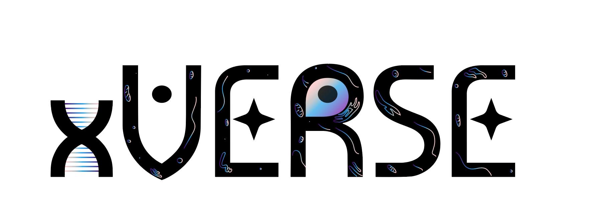

<p align="center">
  
</p>

# xVERSE Fine-Tuning and Inference

xVERSE is a **transcriptomics-native foundation model** that couples batch-invariant representation learning with the probabilistic generation of gene expression count profiles. By doing so, xVERSE not only learns robust biological representations but also is capable of synthesizing high-fidelity virtual cells.

This repository provides a unified pipeline (`finetune.py`) to extract embeddings, fine-tune the xVERSE model, and perform generation/imputation tasks on single-cell or spatial transcriptomics data.

## 1. Prerequisites

### Environment
Ensure you have a Python environment (e.g., conda or venv) with the following packages installed:

*   `torch`
*   `scanpy`
*   `pandas`
*   `numpy`
*   `scipy`
*   `tqdm`
*   `matplotlib`

### Input Data Format
The script accepts **`.h5ad` files** (AnnData format). Your input files **MUST** meet the following requirements:

1.  **Tissue Label**: A column named **`tissue`** in `adata.obs`.
    *   Values must match entries in `tissue_name_to_id_map.csv` (e.g., 'liver', 'kidney', 'lung').
2.  **Gene IDs**: A column named **`gene_ids`** in `adata.var`.
    *   This column must contain **Ensembl IDs** (e.g., `ENSG00000123456`) to align with the pretrained model.

## 2. Usage

The script is run via the command line:

```bash
python -m main.finetune --input_dir <INPUT> --output_dir <OUTPUT> --base_model <MODEL_PATH> [OPTIONS]
```

### Common Arguments
| Argument | Description | Required |
| :--- | :--- | :--- |
| `--input_dir` | Directory containing `.h5ad` files or path to a single file. | Yes |
| `--output_dir` | Directory where results will be saved. | Yes |
| `--base_model` | Path to the pretrained xVERSE model (`.pth`). | Yes |
| `--tissue_name` | Name of the tissue (e.g., 'liver'). | Yes |
| `--task` | Task to perform: `embedding` or `generation`. | Yes |
| `--mode` | `0shot` (Pretrained) or `ft` (Fine-tune). | No (Default: `0shot`) |
| `--gpu` | GPU ID to use (e.g., `0`). If omitted, uses available GPU. | No |
| `--num_samples_gen` | Number of sparse Poisson samples to generate (Generation task only, default: 5). | No |

### Examples

#### Scenario A: Zero-Shot Embedding Extraction
Extract biological embeddings (`z_bio`) using the pretrained model without modification.

```bash
python -m main.finetune \
    --input_dir ./data/liver_samples \
    --output_dir ./results/embeddings \
    --base_model ./checkpoints/xverse_pretrained.pth \
    --tissue_name liver \
    --mode 0shot \
    --task embedding
```
**Output**: 
- `.h5ad` files in output directory with `adata.obsm['xVerse']` containing the embeddings.

#### Scenario B: Zero-Shot Generation / Imputation
Perform imputation/virtual cell synthesis using the pretrained model directly (no fine-tuning).

```bash
python -m main.finetune \
    --input_dir ./data/liver_samples \
    --output_dir ./results/zeroshot_imputation \
    --base_model ./checkpoints/xverse_pretrained.pth \
    --tissue_name liver \
    --mode 0shot \
    --task generation \
    --num_samples_gen 5
```
**Output**: 
- `.h5ad` files with `adata.layers['mu_bio']` (reconstruction) and sparse samples (`sample_0`...).

#### Scenario C: Fine-Tuning for Imputation/Generation
Fine-tune the model on your data, then generate denoised gene expression (`mu_bio`).

```bash
python -m main.finetune \
    --input_dir ./data/liver_samples \
    --output_dir ./results/imputation \
    --base_model ./checkpoints/xverse_pretrained.pth \
    --tissue_name liver \
    --mode ft \
    --task generation \
    --num_samples_gen 5
```
**Output**: 
- `.h5ad` files in output directory with `adata.layers['mu_bio']` containing the reconstruction.
- `adata.layers['sample_0']` ... `adata.layers['sample_4']`: Sparse Poisson samples drawn from `mu_bio`.
- `best_model_liver_ft.pth`: The fine-tuned model checkpoint.

#### Scenario D: Fine-Tuning followed by Embedding Extraction
Adapt the model to your specific dataset (e.g., to handle strong batch effects) before extracting embeddings.

```bash
python -m main.finetune \
    --input_dir ./data/liver_samples \
    --output_dir ./results/ft_embeddings \
    --base_model ./checkpoints/xverse_pretrained.pth \
    --tissue_name liver \
    --mode ft \
    --task embedding \
    --epochs 20
```

## 3. Output Details

The script preserves the mapping between input files and output files.

*   **Embedding Task**:
    *   Outputs are saved as `.h5ad` files.
    *   **`adata.obsm['xVerse']`**: Stores the `z_bio` (biological embedding) matrix.
    
*   **Generation Task**:
    *   Outputs are saved as `.h5ad` files.
    *   **`adata.layers['mu_bio']`**: Stores the `mu_bio` (denoised/reconstructed expression) matrix.
    *   **`adata.layers['sample_X']`**: Sparse count matrices sampled from the Poisson distribution (e.g., `sample_0`, `sample_1`...), controlled by `--num_samples_gen`.
    *   *Note*: The output file is subset to the genes present in the model (intersection of input genes and model training genes).

*   **Combined Visualization**:
    *   If multiple files are processed in `embedding` mode, a `combined_umap.png` is generated for quick inspection.
